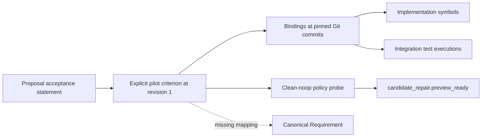

# RFC 0221: SpecGraph refactoring binding pilot

## Result and scope

The pilot exercises SpecGraph's own repaired-candidate readiness refactoring:
[PR 743](https://github.com/0al-spec/SpecGraph/pull/743) extracted a named no-op
handoff policy; [PR 744](https://github.com/0al-spec/SpecGraph/pull/744)
centralized readiness in the repair producer and removed the redundant handoff
policy. Four existing acceptance statements are linked to their actual source,
implementation symbols, tests and one available policy trace.

This is an **agent-curated experimental mapping**, available for review. The
criterion IDs and revision 1 were authored for this pilot on 2026-10-02. They
were not present at the historical commits. Git checkpoints select source and
test versions; they do not allocate or reconstruct adopted subject revisions.
The isolated `pilot:baa72850-bf2e-42c6-a3a9-68930a1ba44e` declaration is not the
canonical SpecGraph workspace identity. No proposal is relabelled as a canonical
Requirement, and no source spec or production rule was changed.

The [curated report](0221_refactoring_binding_pilot.json) records:

| Checkpoint | Commit | Criterion/source bindings | Selected integration tests |
| --- | --- | --- | --- |
| Before PR 743 | `0d3b0048055919e67b745cc2261977e5e4f76def` | 4/4 | 4 passed |
| After PR 743 | `7fc2836acf68815edfc68d0dc8a500ddb067f304` | 4/4 | 4 passed |
| After PR 744 | `aeabe4af7d3007ed23ccab90c0ab45bbd51ba448` | 4/4 | 4 passed |

The four source statements are unchanged across these checkpoints. The pilot
therefore uses one explicit criterion revision for each. Refactoring changes
the implementation bindings, not those criterion addresses. Test functions are
loaded from each checkpoint independently; their source hashes are retained.
These 12 successful executions support the selected scenarios, not equivalence
of all possible behavior. The selected four production modules and two test
files are also byte-for-byte unchanged between PR 744 and merged PR 748
(`eb517db71a2d04a27982794d5dfd595bbcff2489`).

## What is linked

| Pilot criterion, revision 1 | Existing source | Bound behavior and evidence |
| --- | --- | --- |
| `ac.clean-noop` | Proposal 0191, Acceptance Criteria | Clean pre-SIB plus no actions produces ready no-op; producer test, handoff test and direct policy trace |
| `ac.repaired-preview` | Proposal 0177, Acceptance Criteria | Structural issues repaired in preview retain `pre_sib_findings_repaired_by_preview`; approval-ready-chain integration test |
| `ac.approval-boundary` | Proposal 0177, Acceptance Criteria | Approval-ready does not grant Platform promotion; the same integration test asserts the separate false flag |
| `ac.unresolved-gaps` | Proposal 0177, Acceptance Criteria | Remaining gaps keep handoff blocked; unresolved-repaired-gaps integration test |

The manifest contains the full exact criterion reference on every binding.
The source path is a locator, the Git SHA pins implementation evidence, and the
criterion revision pins its authored meaning. None substitutes for another.
Code anchors require a unique top-level Python AST symbol. Statement matching
only verifies the supplied words at the pinned source; semantic correspondence
between a criterion, function and test remains the authored mapping assertion.



## Runtime and negative probes

The current policy at the PR 744 commit emitted real TraceRecorder events:

| Probe | `ready` | `no_op_repair_loop` | Trace outcome |
| --- | --- | --- | --- |
| Clean no-op, no findings | true | true | `satisfied` |
| No-op with findings | false | true | `unsatisfied` |

Both events are `candidate_repair.preview_ready`, bound to the full exact
`ac.clean-noop` reference through the authored manifest surface. This is a
**direct policy probe**, not a trace captured from the production CLI, a runtime
receipt, or evidence that all four criteria are independently instrumented.
The invalid-input probe exposes the guard around readiness while retaining the
independent no-op observation.

The former `_is_clean_pre_sib_noop_passthrough` symbol resolves at the PR 743
commit. The same file/symbol at PR 744 returns `missing_path`. The harness does
not redirect it to the new producer rule. Requesting revision 2 of any of the
four pilot criteria returns `unavailable_revision`. Current lookup and exact
revision-1 lookup select the same authored content, as covered by focused tests.

## Reproduce

Use the repository virtual environment and a **new** output directory:

```bash
.venv/bin/python tools/subject_refactoring_pilot.py \
  --execute --output-dir runs/subject-refactoring-pilot/my-run

.venv/bin/python tools/subject_read_model_io.py \
  --snapshot runs/subject-refactoring-pilot/my-run/subjects.json \
  --workspace-identity pilot:baa72850-bf2e-42c6-a3a9-68930a1ba44e \
  --subject-class criterion --subject-id ac.clean-noop --revision 1
```

The [authored plan](../../tools/subject_refactoring_pilot.json) supplies the
explicit snapshot and bindings. The harness exports each pinned commit into a
separate temporary directory, runs the exact selected test node IDs, reads JUnit
results, and removes the temporary checkout. It does not fetch Git objects,
install dependencies, import historical code into the current process, or alter
canonical files. Missing commits are a failure requiring the caller to obtain
history first. Installed Python/dependency versions and the SpecificationCore
commit are recorded; historical lockfile environments are not reconstructed.

An existing output directory is rejected. Raw JUnit and test logs remain in each
run's checkpoint directory; the report contains their hashes and parsed results.
Only the curated report is checked in. Fresh runs have different raw log hashes
because pytest includes timing and temporary paths; compare pinned source,
criterion references, case identities, outcomes and trace observations instead.

Exit 0 means all selected source checks, tests, trace and negative probes passed
within this pilot. Exit 1 means incomplete evidence (including an intentionally
source-only run without `--execute`); exit 2 means invalid input or execution
failure. No exit code grants canonical readiness or approval. The report always
states `canonical_mutations_allowed: false` and `canonical_readiness: not_evaluated`.

## Gaps revealed and next slice

The existing proposal runtime registry provides proposal-to-tool/test markers;
it does not establish these four canonical criterion identities or a canonical
Requirement binding. The promotion registry entries for 0152/0177/0191 remain
working-draft source records without an explicit canonical Requirement target.
The pilot leaves `canonical_requirement: null` instead of manufacturing that
relationship. Historical subject revisions, adoption of the pilot IDs, and
Requirement-to-criterion links require their own explicit mapping/adoption step.

The [Requirement mapping review](0221_requirement_mapping_review.md) prepares
two separate concerns: review readiness with three criteria and separate
promotion approval with one. Its namespace mapping is explicit and pending
review; it does not populate this pilot's `canonical_requirement` fields or
relocate historical evidence. Canonical storage and its validating writer must
be approved and implemented before materialization. Production trace bindings,
lineage inference, Hypercode binding and longitudinal quality claims remain
outside this experiment.
