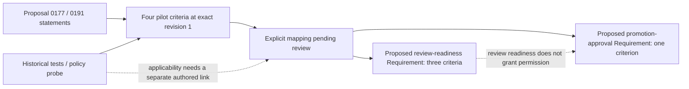

# RFC 0221: repaired-candidate Requirement mapping review

## Status and decision to review

**Prepared for review; not adopted.** The [machine-readable packet](0221_requirement_mapping_review.json)
proposes two standalone `kind: requirement` nodes and maps all four exact pilot
criterion references to them. `gate_state` is `review_pending`,
`canonical_readiness` is `not_evaluated`, and `ready_for_materialization` is false.
The [preparation evidence](0221_requirement_mapping_evidence.json) distinguishes
the failed supervisor attempt from the subsequent structural checks.

This follows the [refactoring binding pilot](0221_refactoring_binding_pilot.md)
in PR #749. Preparation changes no production behavior, canonical graph nodes,
workspace declarations, historical report, or approval authority. Merging this
review packet would publish the proposal; it would not adopt its destinations.

## Why the mapping was missing

At pilot source revision `492171dc87c4f0b0a1559d0bb04292739ba227f1`, the graph
contains 68 `kind: spec` nodes and no standalone `kind: requirement` nodes.
[SG-SPEC-0001](../../specs/nodes/SG-SPEC-0001.yaml) defines the Requirement kind,
but a kind definition is not a Requirement for this particular behavior.
The closest existing specs govern traceability (SG-SPEC-0020), pre-spec promotion
(SG-SPEC-0051), and subject identity (SG-SPEC-0068). They supply governance context
rather than the concrete repair-loop/handoff demands from proposals 0177 and 0191.

The pilot consequently created four explicitly experimental criterion subjects
and linked source, code, tests, and one policy probe. It left
`canonical_requirement: null`. Filling that field with a convenient spec ID
would misclassify a `spec` as a `Requirement` and invent an adopted relationship.

## Proposed requirements and criterion membership

| Proposed Requirement | Statement | Exact pilot criteria, all revision 1 |
| --- | --- | --- |
| `req.repaired-candidate-review-readiness` | The repair producer and handoff must preserve review readiness for a clean no-op or a valid repaired preview, retain repair evidence, and keep unresolved candidate gaps blocking. | `ac.clean-noop`, `ac.repaired-preview`, `ac.unresolved-gaps` |
| `req.platform-promotion-approval-boundary` | Repair readiness must not authorize Platform promotion; the repair-session journal retains `ready_for_platform_promotion` false until a separate approval decision. | `ac.approval-boundary` |

Readiness belongs to the repair/handoff decision; promotion permission belongs to
the separate approval decision. Their evidence may come from the same test, but
that does not make them one Requirement. The packet retains the four existing
criterion statements verbatim and proposes a **3 + 1** membership partition.
These criteria cover the selected pilot cases, not every condition in the
promotion gate or a complete product specification.

The candidate nodes are proposed independent Requirement files. They are not
embedded second copies of canonical Requirements inside this review's temporary
`kind: spec` draft. The draft only describes the mapping decision.



## Addressing and history

The source references retain workspace
`pilot:baa72850-bf2e-42c6-a3a9-68930a1ba44e`. The proposed destination namespace is
`workspace:a2800523-3588-4820-a47f-9fddc0fed3f5`. Its UUID and local IDs are concrete
review tokens; they are **not reserved canonical identities**. The proposed
declaration path `specs/workspace_identity.yaml` has not been written.

For example, the proposed mapping is:

```yaml
source:
  subject:
    workspace_identity: pilot:baa72850-bf2e-42c6-a3a9-68930a1ba44e
    subject_class: criterion
    local_subject_id: ac.clean-noop
  mode: exact
  revision: 1
proposed_destination:
  subject:
    workspace_identity: workspace:a2800523-3588-4820-a47f-9fddc0fed3f5
    subject_class: criterion
    local_subject_id: ac.clean-noop
  mode: exact
  revision: 1
```

Because workspace identity is part of identity, the destination has a
**distinct identity**; these are different subjects.
Keeping the local ID and wording does not make this a same-identity move or a
revision-2 successor. The reviewed namespace mapping must explicitly record both
full references, the source occurrence, decision, reviewer authority, timestamp,
rationale, and provenance. Pending fields remain null; no human decision is
invented.

Each proposed Requirement revision 1 pins its own full exact destination
`acceptance_criteria_refs`. The destination subjects would begin at their actual
adoption time with no same-identity predecessor. The pilot's records and the
three historical Git checkpoints retain their existing meanings. Original test
executions and trace events must not be relabelled as destination events. An
explicitly reviewed applicability link can relate retained evidence to the new
criterion; it is not a new execution or a trusted runtime receipt.

## Physical decisions and materialization gates

[SG-SPEC-0068](../../specs/nodes/SG-SPEC-0068.yaml) already approves identity
semantics. Its [approval packet](0221_canonical_contract_approval.md) explicitly
defers physical criterion/history storage, declaration location, local ID syntax,
allocation, and migration application. The following choices therefore need an
explicit decision before canonical materialization:

1. Approve the two Requirement statements and their 3 + 1 criterion membership.
2. Approve or revise the proposed canonical workspace token, declaration path,
   local ID conventions, standalone Requirement storage, and criterion storage.
   The proposed `specs/requirements/*.yaml` locations are review suggestions;
   current canonical loaders do not yet read them.
3. Implement a validating writer and canonical-source adapter for the approved
   physical schema. `subject_read_snapshot` remains an exchange/fixture format.
   Pending candidates cannot be parsed as canonical Requirement records by
   fabricating `canonical_presence: active`.
4. Record the reviewed source-to-destination mappings and the complete
   SpecDraft-to-canonical transition required by SG-SPEC-0051.
5. Materialize only after those gates pass, then author destination evidence
   applicability separately. Canonical Requirement membership, evaluation of
   readiness, and a later Platform promotion approval remain distinct decisions.

No canonical parent is edited and no seed node kind is introduced by this packet.
Neither a merged PR nor this review artifact satisfies the human decision gate
defined by the Constitution and SG-SPEC-0051.

## Preparation and validation

The [temporary input draft](0221_requirement_mapping_input.yaml) was used for one
bounded supervisor attempt in an isolated checkout. Sol 6.1 Medium was requested.
The local CLI rejected `gpt-6.1-sol`; no model-authored output or machine completion
markers were produced. The initial draft also had an empty `acceptance_evidence`
collection. That authoring defect was corrected after the failed attempt.

The prepared packet is consequently **agent-authored**, not a successful
supervisor-generated candidate. The failed run and repaired input hashes are
retained separately. Structural validation uses SpecGraph's YAML, atomicity,
allowed-path, and graph reconciliation checks plus typed exact references and
revision-specific membership. It checks four unique source criteria, four
distinct proposed destinations, a complete non-overlapping 3 + 1 partition,
verbatim source statements, and unchanged pilot/canonical files. It does not prove
semantic equivalence, adoption, canonical readiness, or runtime conformance.

The next slice is to review this packet's Requirement partition and namespace
mapping, then implement the approved storage/adapter boundary before applying it.
