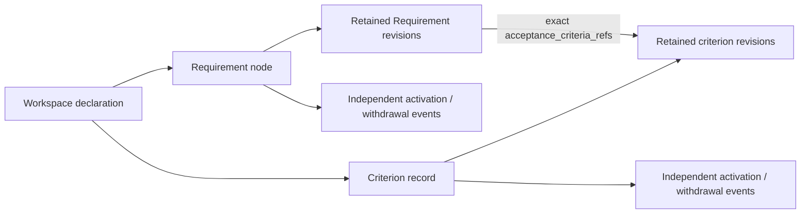

# RFC 0221: physical storage and mapping approval packet

**Prepared for review; not approved or adopted.** This packet selects the corrected
SG-SPEC-0069 version-1 schema merged in [PR #751](https://github.com/0al-spec/SpecGraph/pull/751).
Preparation is authorized by the human instruction “Ок, готовь схему”.

- Reviewed commit (`reviewed_commit`): `ca3967e6b9d1b196c901ff6fcb0f77b7a98ecfc7`.
- Exact review scope digest, `approval_scope_sha256`: `dcaf235e3345ef09604245161b4f0e57c54954fdd0052272a5a0ea27494bd2e1`.
- [Machine-readable packet](0221_subject_storage_approval.yaml): the complete
  physical schema, ten reviewed-file digests, exact identities, statements,
  references, mappings and unfilled decision templates.
- [Read-only validation evidence](0221_subject_storage_approval_evidence.json).

The canonical node remains `gate_state: review_pending`. This prepared packet has
`canonical_adoption: false`, `canonical_readiness: not_evaluated` and
`ready_for_materialization: false`. `CONSTITUTION.md` requires an actual human
decision before schema governance changes. Merge and successful checks are separate
from that decision. A scope digest identifies reviewed content; it is not a signature,
proof of reviewer identity or authorization.

## Three choices and implementation authorization

| Review item | Concrete choice | Effect of an actual approval |
| --- | --- | --- |
| Physical schema | SG-SPEC-0069 v1: standalone YAML nodes/criteria, retained revisions and independent disposition events | Approve this source-controlled physical contract under SG-SPEC-0068 |
| Workspace and IDs | `workspace:a2800523-3588-4820-a47f-9fddc0fed3f5`; six exact local IDs below | Approve the future declaration and ID plan; allocation remains part of separately authorized materialization |
| Requirements and mapping | Two Requirement statements, four criterion statements, exact 3 + 1 membership and four cross-workspace mappings | Record genuine review provenance for this precise mapping; retain source identities and historical evidence |
| Bounded implementation | Read-only source adapter, then validating writer for origins/content revisions | Permit implementation and verification; canonical materialization still requires a separate decision |

## File schema

```text
specs/
  workspace_identity.yaml
  requirements/
    req.repaired-candidate-review-readiness.yaml
    req.platform-promotion-approval-boundary.yaml
  criteria/
    ac.clean-noop.yaml
    ac.repaired-preview.yaml
    ac.unresolved-gaps.yaml
    ac.approval-boundary.yaml
```

These are proposed canonical destinations. The seven current
`subject_storage_candidate` envelopes remain in `docs/reviews/0221_subject_storage/`.
No declaration or canonical subject is created by this packet.



| Record | Required meaning |
| --- | --- |
| Workspace | `schema_version`, `artifact_kind`, immutable declared workspace identity and genuine declaration decision reference |
| Requirement | Existing `kind: requirement`, subject identity, validated current metadata/provenance projection, revision history and labelled current disposition |
| Criterion | Addressable criterion subject with its own revisions; no new canonical seed node kind |
| Revision | Positive number, origin or immediate predecessor, retained node fields, statement, containment, decision reference, authored `revision_scope` and exact acceptance membership |
| Node provenance | SG-SPEC-0024 actor, authority and timestamp; conditional source reference/confidence and defined optional metadata. Retained in `node_fields.provenance`, separate from `revision.provenance` |
| Disposition event | Unique event reference, `activation` or `withdrawal`, genuine decision provenance and authored append order |

Readers validate the complete retained chain. Exact lookup selects historical
content and metadata; it does not invent disposition as of that old revision.
Current projections agree with the selected last content revision and the last
retained disposition event. A retired Requirement remains queryable but cannot
satisfy Requirement-level readiness. Canonical presence comes from governed topology,
not file existence or an `active` disposition.

IDs keep case-sensitive exact spelling. Workspace-wide ASCII lowercase collision
keys reject `REQ.A`/`req.a` at allocation, publication and whole-tree validation,
across subject classes, groups and retired history. Optional grouping components
use lowercase ASCII; they never create a second identity namespace.

The writer requires prior digests, unique origins/next revisions, stable historical
provenance and scopes, full exact references and isolated atomic publication of all
affected records. Unknown fields/versions and unsupported operations fail closed.
These are schema requirements; the adapter and writer are still `not_implemented`.

## Exact statements and 3 + 1 membership

### `req.repaired-candidate-review-readiness`

The repair producer and handoff must preserve review readiness for a clean no-op or a valid repaired preview, retain repair evidence, and keep unresolved candidate gaps blocking.

Exact membership: `ac.clean-noop@1`, `ac.repaired-preview@1`, `ac.unresolved-gaps@1`.

### `req.platform-promotion-approval-boundary`

Repair readiness must not authorize Platform promotion; the repair-session journal retains ready_for_platform_promotion false until a separate approval decision.

Exact membership: `ac.approval-boundary@1`.

All destination references use `workspace:a2800523-3588-4820-a47f-9fddc0fed3f5`, `mode: exact` and revision 1.
These are proposed origins, with no same-identity predecessor; actual origin time
comes from adoption rather than preparation or historical Git checkpoints.

### `ac.clean-noop`

A candidate graph with clean pre-SIB readiness and no repair actions produces a ready no-op repair loop instead of `repair_review_required`.

### `ac.repaired-preview`

If the repaired graph still has pre-SIB structural issues, the normal candidate repair loop may repair them in preview, and the promotion gate must preserve `pre_sib_findings_repaired_by_preview` evidence.

### `ac.unresolved-gaps`

Unresolved repaired candidate gaps keep the handoff blocked.

### `ac.approval-boundary`

The repaired repair-session journal keeps `ready_for_platform_promotion: false` until a separate approval decision.

## Mapping and evidence

All four source refs use `pilot:baa72850-bf2e-42c6-a3a9-68930a1ba44e`, criterion class
and exact revision 1. Destination refs use the proposed workspace above, criterion
class and exact revision 1. The complete source→destination refs, source occurrences,
statement digests and test refs are retained verbatim in the YAML packet.

Different workspaces mean distinct identities. Matching local IDs/text does not
create a same-identity revision, relocation, replacement or topology supersession.
Source plan commit `492171dc87c4f0b0a1559d0bb04292739ba227f1` and the historical pilot
report remain unchanged. Original test executions and policy traces retain their
pilot attribution. Approval of this mapping does not transfer evidence or create
a trusted runtime receipt or Platform promotion approval.

## How to approve this packet

After reviewing the scope bound to the commit and digest above, the human may reply:

> Одобряю пакет SG-SPEC-0069 v1: схему, workspace/ID и mapping 3 + 1; разрешаю ограниченную реализацию adapter/writer. Материализация и перенос evidence остаются отдельными решениями.

The response must identify this delivered packet. The next recording slice will
preserve the actual source quote and decision time, reviewer/authority, rationale,
outcome, reviewed commit, scope digest and provenance. The YAML decision templates
remain null now. A changed reviewed scope requires another explicit decision;
the packet must not silently follow the latest branch or matching text.

Record the genuine decision separately, retaining this packet and the original
mapping packet as historical preparation. Only then resolve the appropriate
SG-SPEC-0069 review gate. The approval does not itself authorize publication of
canonical subjects. After adapter/writer verification, a separate materialization
decision supplies workspace/origin provenance and SG-SPEC-0051 transition records.

## Verification and next slice

Focused tests check exact scope/file digests, inherited schema retention,
statement/reference fidelity, 3 + 1 membership and unfilled decision fields.
Read-only SpecGraph validation checks node outputs, allowed paths, atomicity,
graph reconciliation and the operational review gate. Its diagnostic `done`
is not approval, canonical adoption, readiness or writer conformance.

After the human decision is recorded, the first implementation slice is the
read-only source adapter. A subsequent verified writer can handle origins and
content revisions. Canonical materialization, source migration and destination
evidence applicability each retain their separate authorization boundaries.
