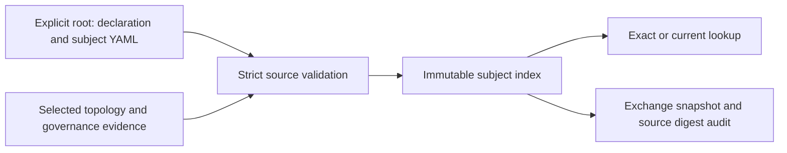

# Read-only canonical subject source adapter

RFC 0221 / SG-SPEC-0069 v1 now has a bounded read-only source adapter:
`tools/subject_canonical_source.py`. It follows the human approval of the exact
[PR #752 packet](reviews/0221_subject_storage_decision.md). The
[approved physical storage contract](../specs/nodes/SG-SPEC-0069.yaml) is unchanged.

## Source selection



`read_canonical_source(root, topology)` reads only
`specs/workspace_identity.yaml`, and every YAML record beneath
`specs/requirements/` and `specs/criteria/`. Constructors store typed immutable
values without filesystem I/O. Missing declaration is invalid input; an empty
declared workspace is allowed. Existing `specs/nodes` and `docs/reviews` are
outside this source slice. Candidate envelopes never become canonical records.

`CanonicalSourceRead` retains the normalized selected root, declaration
provenance, workspace/dataset binding, topology/evidence references and SHA256
for each selected file. Identity comes from the persisted declaration and exact
subject reference; a directory name, repository remote or commit cannot allocate it.

## Structural checks and retained metadata

| Surface | Check |
| --- | --- |
| Format | Canonical YAML formatting; duplicate/unknown keys and unsupported versions rejected |
| Workspace | Persisted `workspace:<lowercase UUID>`, declaration decision reference and exact topology binding |
| Namespace | Shared ASCII IDs across classes, groups and retired records; lowercase collision keys reject aliases without coalescing exact identities |
| Paths | Exact filename ID, lowercase ASCII groups, relative containment, no traversal/symlinks; current containment equals actual path |
| History | Complete contiguous chain from revision 1, immediate predecessors, explicitly selected last revision; frozen subjects cannot advance and Requirement status cannot regress |
| Metadata | Current projection equals retained node fields; Requirement status and SG-SPEC-0024 provenance validated in every revision |
| Scope | Authored nonempty `revision_scope` retained, never reconstructed from a diff |
| Membership | Exact criterion pins resolve in the selected index; criteria own no acceptance membership |
| Disposition | Unique activation/withdrawal events and current projection selecting the last authored event |
| Consistency | File digests and inventory rechecked before return; ordinary concurrent changes reject the read |

Exact lookup returns the selected revision's title, status, authority, source
reference, full node provenance, statement, containment, scope and acceptance
pins. Disposition is explicitly current. Optional provenance fields and nested
`trace_context` retain their supplied shape; nested JSON is stored immutably and
exported as detached values. Physical revision order is not identity; disposition
event order is retained independently rather than sorted by event ID.

## Explicit topology boundary

Stored records cannot author `canonical_presence`. The caller supplies
`CanonicalTopologySelection` with one `CanonicalRequirementPresence` per stored
Requirement and no extras. Presence is `active` or `historical_lineage_only`,
independently of file existence or current disposition.

The selection includes `workspace_identity`, `dataset_identity`, `topology_ref`,
`governance_evidence_ref` and a tuple of full Requirement refs with their presence.
For CLI usage, the experimental YAML/JSON selection exchange requires
`schema_version: 1`, `artifact_kind: subject_canonical_topology_selection`,
those four binding fields and a `requirements` list. Every list entry contains
`subject` and `canonical_presence`; `subject` has the ordinary full reference
shape from the [read model](subject_read_model.md).

This is a caller-supplied projection, not a second canonical storage format or a
trusted authority receipt. Nonempty decision references establish structure;
this slice does not attest whether those decisions are genuine. The audit labels
`governance_evidence_verification: caller_selected_not_attested`. A future
governed-topology producer supplies its authoritative selection and evidence.
External subject relations are not loaded. Enumeration completeness remains
bounded to the supplied storage slice.

## CLI and exchange compatibility

```bash
.venv/bin/python tools/subject_canonical_source.py \
  --source-root /path/to/selected/workspace \
  --topology-selection /path/to/selected-topology.json \
  --subject-class Requirement --subject-id req.readiness --revision 1
```

These paths and the subject ID illustrate an explicitly supplied workspace;
the approved future SpecGraph origins are still unallocated. Omit lookup flags
to validate/export the complete selected source. Use `--current` for current
content. JSON goes to stdout; exit codes are `0` for a valid export/resolved lookup,
`1` for an unresolved lookup and `2` for invalid input/arguments.

`subject_canonical_source_read` reports `validation_status: passed`, a source
audit and an explicit `subject_read_snapshot`. Snapshot v1 adds optional paired
`node_fields`/`revision_scope` and optional `retained_disposition_order`. These
are exchange fields, not changes to the approved physical schema. Legacy
snapshots retain their previous output shape and may describe incomplete retained
history. Canonical source reads require a complete chain and authored event order.
Export/reparse retains dataset binding, metadata and disposition order.

## Evidence and next slice

`tests/test_subject_canonical_source.py` uses temporary fixture origins only.
It checks historical lookup, source immutability, export round-trip, topology
binding, negative schema/provenance/path/reference cases and concurrent changes.
Existing snapshot, legacy and pilot tests run alongside it.

This is `partial_canonical_source_adapter` evidence. Reports retain
`canonical_readiness: not_evaluated`, `ready_for_materialization: false` and
`canonical_mutations_allowed: false`. Repeated reads detect ordinary changes;
they do not provide an atomic filesystem snapshot or trusted runtime receipt.
The [bounded Git writer](subject_source_write.md) now enforces prior digests,
retained history immutability and isolated atomic publication through a dedicated
source ref. Its immutable commit export uses this reader for whole-source
validation. Canonical materialization, migration and evidence applicability
remain separate decisions.
