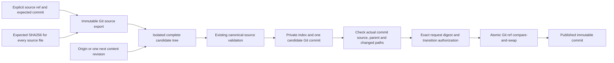

# Validating subject source writer

RFC 0221 / SG-SPEC-0069 v1 has a bounded origin/content-revision writer in
`tools/subject_source_write.py`, with a Git publication boundary in
`tools/subject_source_git.py`. The [approved physical schema](../specs/nodes/SG-SPEC-0069.yaml)
and [recorded human implementation approval](reviews/0221_subject_storage_decision.md)
remain unchanged. Tests publish only in temporary fixture repositories.

## Publication boundary

The result identifies this backend as `git_commit_compare_and_swap_v1`.



The selected repository contains an **existing direct ref** beneath
`refs/specgraph/subject-storage/`. Its value is the source version; it is not a
workspace identity or a second storage schema. Repository roots and request
paths are explicit. The writer never checks out a branch or changes the operator's
working tree, ordinary branches, tags or index. Unrelated tracked files retain
their original bytes and modes in the published commit. Inherited Git environment
overrides and replacement objects cannot select another repository or index.

The whole source tree is exported from the expected immutable commit. The writer
checks every source digest, stages complete records outside the selected source,
and uses the existing [canonical-source adapter](subject_canonical_source.md).
Git objects are prepared using a private index. Their source, sole parent and
exact changed-path set are checked before publication. Candidate cleanup finishes
before the one `git update-ref --no-deref <ref> <new> <expected>` operation.
Concurrent successors fail closed at that compare-and-swap boundary.

Readers select one published commit and export its source. Ordinary filesystem
checkouts retain their existing read contract; updating a checkout is a separate
operator action. One Git ref update is the atomic source-controlled publication.
This backend does not claim a transactional multi-file checkout or crash-durable
publication independent of Git's storage configuration.

## Bounded transitions

| Operation | Required checks |
| --- | --- |
| `origin` | No existing exact subject or target; shared portable namespace free; revision 1 with null predecessor; one authored activation event |
| `content_revision` | Exact expected prior file SHA256; existing same-identity subject; one immediate successor; every retained revision and disposition unchanged |
| Workspace bootstrap | Complete source absent; explicit declaration with workspace identity and declaration decision provenance; origins validated together |

The declaration is immutable after allocation. Exact acceptance references resolve
in the complete candidate, so a new criterion and the Requirement revision pinning
it publish together. Two Requirement membership revisions may be in the same batch.
Frozen Requirement history cannot advance and status cannot regress. The first writer
rejects containment moves, disposition operations, replacements, relations, topology
mutations and migrations. Caller-selected topology presence remains an independent
read binding; it is not written into records or inferred from their existence.

## Request and authorization contracts

`subject_source_write_request`, version 1, requires these fields:

- `source_ref`: the selected dedicated direct ref.
- `expected_commit`: its full lowercase commit ID, including for bootstrap.
- `recorded_at`: the explicit timezone-aware publication timestamp.
- `topology_selection`: the existing `subject_canonical_topology_selection` exchange,
  covering exactly the final Requirements, workspace and dataset.
- `expected_source_file_sha256`: the complete prior path/SHA256 map; empty for bootstrap.
- `changes`: each entry contains `operation`, `path`, `expected_prior_sha256` and
  `proposed_record`, a complete version-1 physical record. An origin's prior digest
  must be null. A revision's digest must match its prior file.
- `workspace_declaration`: optional complete declaration; required only for bootstrap.

Duplicate YAML keys, unknown fields, unsupported versions, malformed provenance,
unresolved pins and invalid paths fail closed. Candidate envelopes and snapshot
exchange documents are not accepted as physical records. Metadata and authored scope
come from the supplied records; the writer does not invent human provenance.

Version-1 `request_sha256` hashes UTF-8 canonical JSON of `asdict(parsed_request)`:
sorted keys, `ensure_ascii=False`, separators `(',', ':')`, no NaN, no trailing newline.
Parsing sorts the expected digest pairs and canonically serializes each proposed
YAML record into immutable text. Change order is retained. The digest binds the ref,
expected commit, workspace/dataset/topology, full prior digest inventory, publication
timestamp and every complete proposed record. Use preview or the API `request.digest()`
to obtain it.

`subject_source_write_authorization`, version 1, requires `request_sha256`,
`decision_ref`, `reviewer`, `reviewer_authority: human_project_author`, timezone-aware
`recorded_at` and unique `transition_refs`. Those refs must cover **exactly** the
new revision decision references, origin activation provenance and any new workspace
declaration provenance. Authorization for a different request is rejected.

Publication now also requires the [governed publication gate](subject_publication.md).
Pass immutable `subject_publication_evidence` through `--governance` or the API's
`governance` argument. Before candidate creation the gate resolves the reviewed
packet, actual attributed human decisions, Intent lineage, paired transitions,
workspace allocation, activation, topology and exact request permission. Schema
approval cannot substitute for permission to materialize subjects. Success is
labelled `scope_bound_recorded_decisions_verified_not_attested`; reviewer identity
and external cryptographic attestation remain outside this boundary.

## CLI and reading a published source

```bash
.venv/bin/python tools/subject_source_write.py \
  --repository-root /path/to/repository --request /path/to/write-request.yaml --preview

.venv/bin/python tools/subject_source_write.py \
  --repository-root /path/to/repository --request /path/to/write-request.yaml \
  --authorization /path/to/exact-write-authorization.yaml \
  --governance /path/to/immutable-evidence-selection.yaml
```

Preview returns a validated candidate commit and request digest without updating
the ref. It can leave unreachable immutable objects for ordinary Git cleanup;
candidate files and the private index are temporary. The result distinguishes
`status: prepared` from `status: published` and reports `source_ref_updated`.
Exit codes are `0` for preparation/publication, `2` for invalid input or a preparation
failure, `3` for stale source/digest or publication conflicts, and `4` for
`governance_blocked`. Existing publication calls without governance fail closed;
preview remains available. JSON goes to stdout.
Read the exact published commit through the existing source adapter:

```python
with SubjectSourceCommit(repository, result['candidate_commit']).export() as root:
    source = read_canonical_source(root, explicitly_selected_topology)
    index = source.index
```

`canonical_readiness` remains `not_evaluated` and `ready_for_materialization` remains
false; the result is not a trusted runtime receipt. No production workspace or subject origin is allocated by this implementation
PR. The next slice is a separately reviewed materialization packet using genuine
SG-SPEC-0051 transition records and destination-specific evidence decisions.

## Review prevention

PR #758 found two `artifact_contract_validation_gap` cases in diagnostic
classification. A deleted dedicated ref now produces `source_conflict`/3,
including deletion before validation, before publication and at CAS. A malformed
`expected_commit` is rejected by typed request construction as `invalid_input`/2.
Prevention is `regression_test_added`: `test_deleted_ref_is_a_cli_source_conflict`
and `test_malformed_expected_commit_is_invalid_input` in
`tests/test_subject_source_write.py`. Neither failure publishes a source ref.
